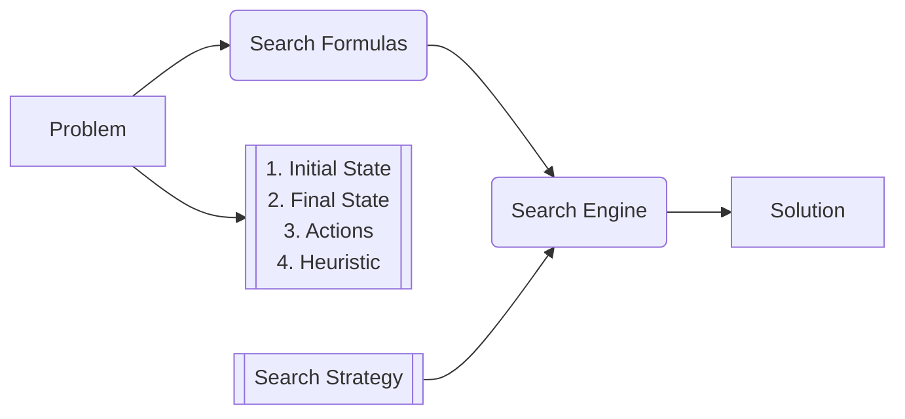

# Lecture 1

## Reasoning

- Deduction:
  - What is implied by what we know?
- Belief Revision:
  - What beliefs to give up in case of a contradiction?
- Causality:
  - What is the cause of an event?

## NLP (Processing vs. Understanding)

- Syntactic Ambiguity:
  - "They are cooking apples" (The apples are for cooking or "they" are cooking
    them?)
- Semantic Ambiguity:
  - "She ran to the bank" (River bank or monetary bank?)
- Pragmatic ambiguity:
  - "Can you open the door?" (Is this a question or a request?)

## Prompt Engineering

# Lecture 2

## Problem Solving Using Search

### Knowledge Representation & Reasoning

1. Problem Solving using Search
2. Symbolic (logic)
3. Numeric (probability)
4. Machine Learning

Examples: Two-player games, constant satisfaction problem

Initial State

| 1 | 4 | 3 |
| - | - | - |
| 5 | 2 | 6 |
|   | 8 | 7 |

$\downarrow$ Action: Move 5 down

| 1 | 4 | 3 |
| - | - | - |
|   | 2 | 6 |
| 5 | 8 | 7 |

We represent all next possible states with a tree. Tree is potentially
infinitely large (can repeat same moves over and over again).

### Optimal Search Strategy

1. Cost of a solution
2. Cost of finding an (optimal) solution

### Things to consider

1. **State Space:** Number of states
2. **Branching Factor:** Max amount of children a node can have
3. **Depth of Optimal Solution:** Number of steps required to solve optimally

### Constraint Satisfaction

Example: Place 8 queens on a chess board such that none of them attack each
other. Can't give final state immediately (this is the solution!) but we can
give a test (function) to tell us if a state is a solution or not.
