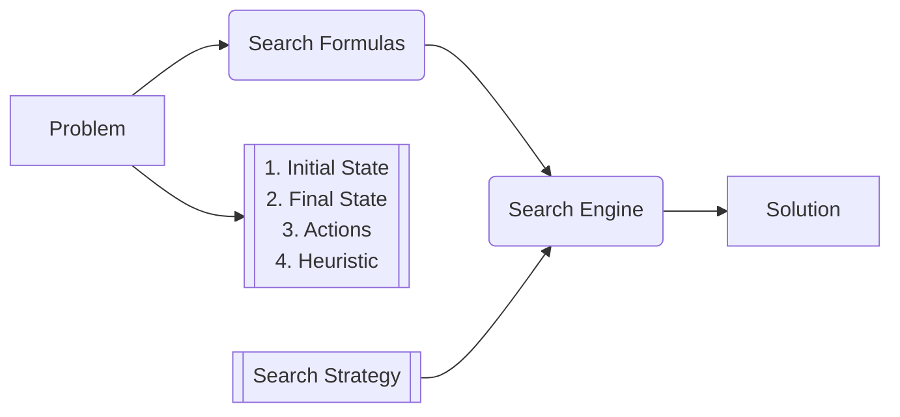
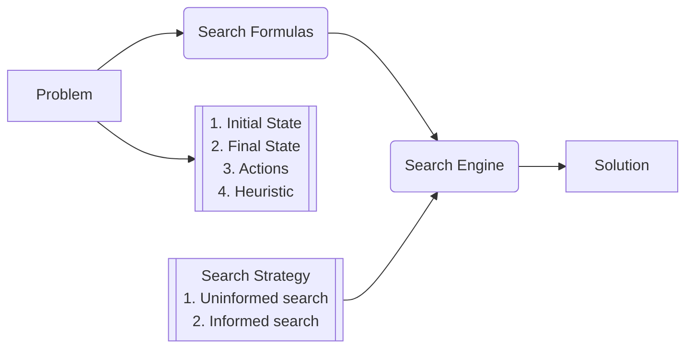
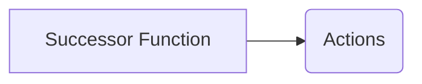
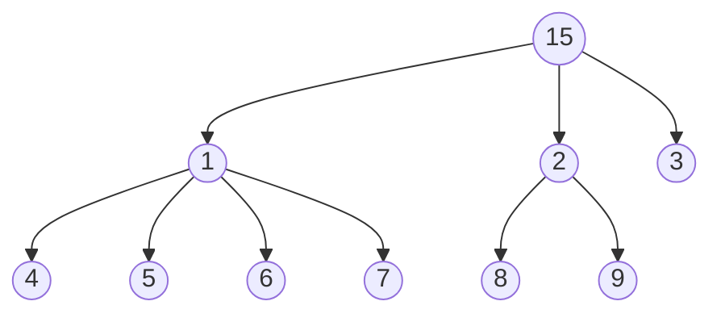
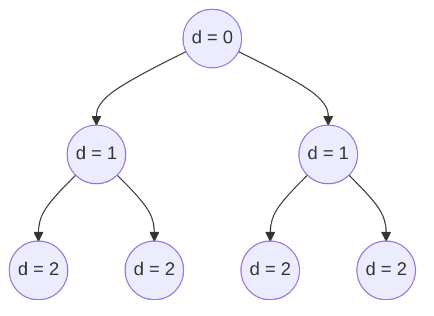
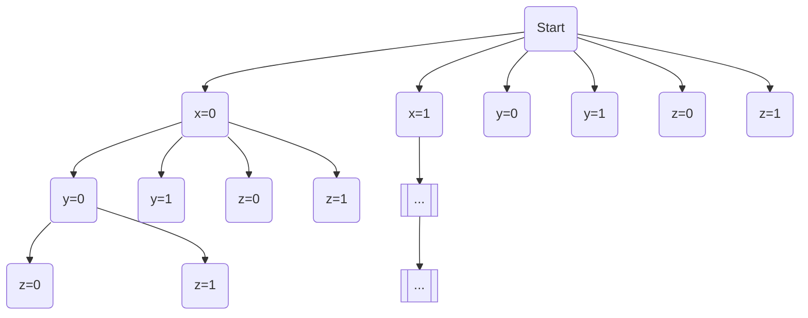
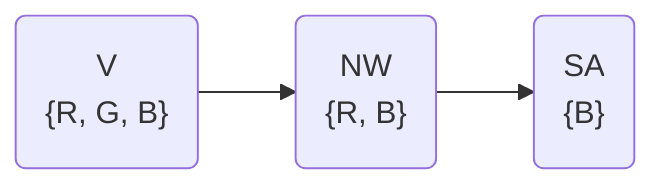

# Lecture 1

<!-- center mermaid diagrams -->

## Reasoning

- Deduction:
  - What is implied by what we know?
- Belief Revision:
  - What beliefs to give up in case of a contradiction?
- Causality:
  - What is the cause of an event?

## NLP (Processing vs. Understanding)

- Syntactic Ambiguity:
  - "They are cooking apples" (The apples are for cooking or "they" are cooking
    them?)
- Semantic Ambiguity:
  - "She ran to the bank" (River bank or monetary bank?)
- Pragmatic ambiguity:
  - "Can you open the door?" (Is this a question or a request?)

## Prompt Engineering

# Lecture 2

## Problem Solving Using Search

### Knowledge Representation & Reasoning

1. Problem Solving using Search
2. Symbolic (logic)
3. Numeric (probability)
4. Machine Learning

Examples: Two-player games, constant satisfaction problem

Initial State

| 1 | 4 | 3 |
| - | - | - |
| 5 | 2 | 6 |
|   | 8 | 7 |

$\downarrow$ Action: Move 5 down

| 1 | 4 | 3 |
| - | - | - |
|   | 2 | 6 |
| 5 | 8 | 7 |

We represent all next possible states with a tree. Tree is potentially
infinitely large (can repeat same moves over and over again).

### Optimal Search Strategy

1. Cost of a solution
2. Cost of finding an (optimal) solution

### Things to consider

1. **State Space:** Number of states
2. **Branching Factor:** Max amount of children a node can have
3. **Depth of Optimal Solution:** Number of steps required to solve optimally

### Constraint Satisfaction

Example: Place 8 queens on a chess board such that none of them attack each
other. Can't give final state immediately (this is the solution!) but we can
give a test (function) to tell us if a state is a solution or not.

# Lecture 3

## Search Problem

### Successor Function

 

## The Search Process

**The Fringe (Frontier)**: Leaf nodes

**Generation:** Applying the successor function to the fringe to create more
nodes (possible choices). (This is a subpart of expanding a node.)

**Expand:**

1. Check if node is good
2. Generate its children

_Nodes on the fringe are waiting to be expanded._

### Evaluating Search Strategies

**Complete:** Does it always find a solution if one exists? (i.e. it doesn't
enter an infinite loop)

**Optimal:** Does it always find the least-cost solution?

**Time complexity:** Number of nodes generated/expanded

**Space complexity:** Maximum number of nodes in memory

_**Parameters:**_

1. **`b`**: Branching factor `b` is when you apply the successor function, and
   you get a set of nodes, how many nodes can that be (that you get back)?
2. **`d`**: Depth `d` of optimal solution (depth of tree)
3. **`m`**: Total (maximum) depth `m` of the search tree

_**Example:**_

`b` = 2

`d` = 2 (0-indexed)

$N(b,d) = \frac{b}{b-1}b^d = O(b^d)$

### Breadth First Search

Expand fringe nodes that have smallest depth. Use a queue.

- Optimal? Yes
- Complete? Yes
- Time? $O(b^d)$
- Space? $O(b^d)$

### Depth First Search

Expand child nodes recursively, or using a stack.

- Optimal? No (tree could search deeper nodes when goal node is at a lower
  depth)
- Complete? No (tree could be infinite)
- Time? $O(b^m)$
- Space? $O(b\cdot m)$

### Check layer by layer?

- Time? $b^d (\frac{b}{b-1})^2 = O(b^d)$

# Lecture 5

## Constraint Satisfaction Problems (CSP)

- Standard formulation of CSP's as search
- Standard search strategy
- Improvements: six total

### Formulation

- Set of variables $x_1 \ldots x_{n}$ with values $D_1 \ldots D_{n}$
  - These variables are discrete
- Set of constraints
  - Notion of desirability or penalty of violation (hard constraints vs soft
    constraints)
  - Unary (1 variable), Binary (2 variables), or higher-order constraints
    - SAT problem needs higher-order constraints to be NP-complete

**Example:** Three-colorable problem with Australian provinces:

- $x_i : WA, NT, SA, Q, NSQ, V, T$
- $D_i : {Red, Blue, Green}$
- Constraints: $WA \neq NT, WA \neq SA, \ldots$

**Example:** Problem with 3 variables, 2 values

Number of possible states (with repetitions): $n \cdot d + (n-1) \cdot d +
\ldots + 1 \cdot d = n!\cdot d^n$

Max depth `n` (number of variables) and branching factor `d` (number of values)

### Observations

DFS is the best way to traverse such a problem.

**Reason:** There are many more ways such that you can say preemptively that
"this node is dead" and we don't have to traverse any of its children. There are
six methods in total:

1. No constraint is violated
2. two
3. three
4. Forward Checking
5. Arc Consistency
6. six

#### Forward Checking

- Maintain a set of values for each variable
- When you assign a value to a variable, update possible values for other
  variables
- Declare "bad state" if some variable loses all of its values

#### Arc Consistency

- 'Arc' is just an edge from one node to another
- An arc from `x` to `y` is consistent if, for every possible value of `x`,
  there is a compatible value for `y`
- This method finds some conditions that Forward Checking misses
- Checking a particular arc is $O(n^2 \cdot d^2)$

**Example:**

Arc V to NW is consistent, but arc NW to SA is not consistent because if NW is
`B`, SA loses all values.
