# Lecture 1

## Reasoning

- Deduction:
  - What is implied by what we know?
- Belief Revision:
  - What beliefs to give up in case of a contradiction?
- Causality:
  - What is the cause of an event?

## NLP (Processing vs. Understanding)

- Syntactic Ambiguity:
  - "They are cooking apples" (The apples are for cooking or "they" are cooking
    them?)
- Semantic Ambiguity:
  - "She ran to the bank" (River bank or monetary bank?)
- Pragmatic ambiguity:
  - "Can you open the door?" (Is this a question or a request?)

## Prompt Engineering

# Lecture 2

## Problem Solving Using Search

### Knowledge Representation & Reasoning

1. Problem Solving using Search
2. Symbolic (logic)
3. Numeric (probability)
4. Machine Learning

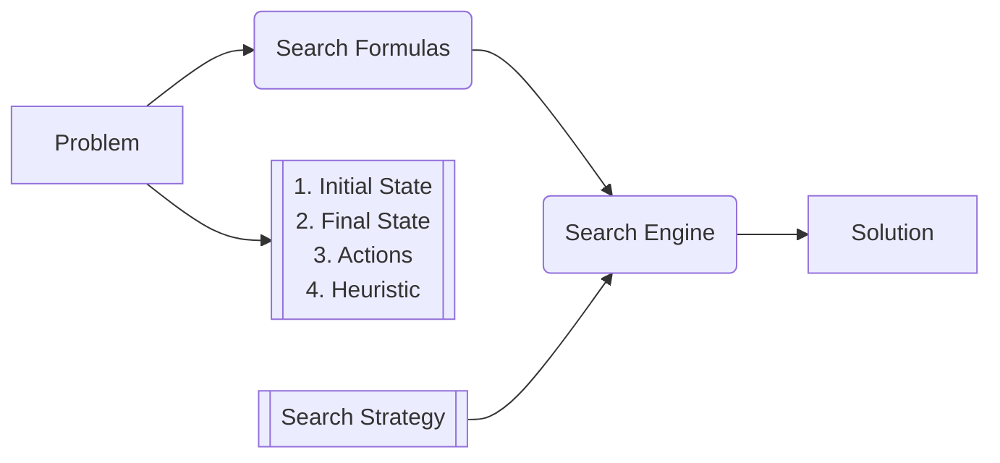

Examples: Two-player games, constant satisfaction problem

Initial State

| 1 | 4 | 3 |
| - | - | - |
| 5 | 2 | 6 |
|   | 8 | 7 |

$\downarrow$ Action: Move 5 down

| 1 | 4 | 3 |
| - | - | - |
|   | 2 | 6 |
| 5 | 8 | 7 |

We represent all next possible states with a tree. Tree is potentially
infinitely large (can repeat same moves over and over again).

### Optimal Search Strategy

1. Cost of a solution
2. Cost of finding an (optimal) solution

### Things to consider

1. **State Space:** Number of states
2. **Branching Factor:** Max amount of children a node can have
3. **Depth of Optimal Solution:** Number of steps required to solve optimally

### Constraint Satisfaction

Example: Place 8 queens on a chess board such that none of them attack each
other. Can't give final state immediately (this is the solution!) but we can
give a test (function) to tell us if a state is a solution or not.

# Lecture 3

## Search Problem

### Successor Function

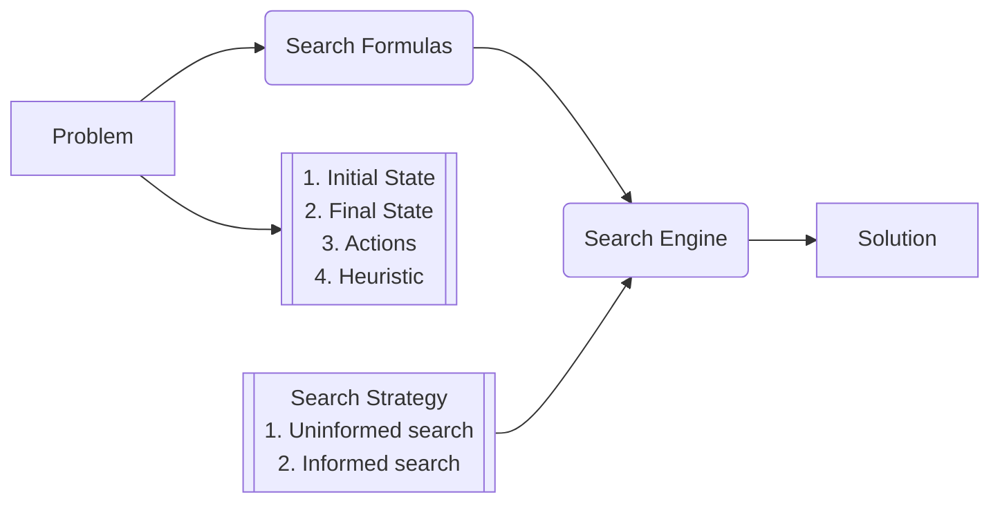

 

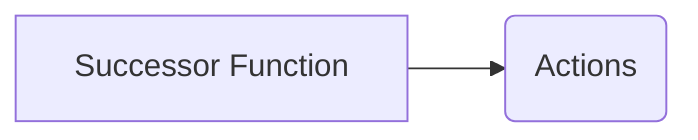

## The Search Process

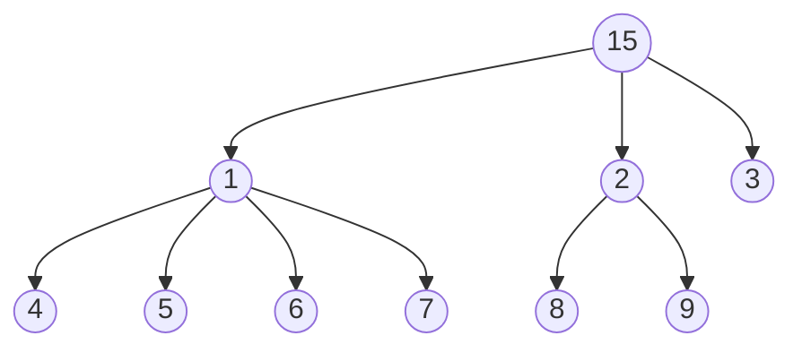

**The Fringe (Frontier)**: Leaf nodes

**Generation:** Applying the successor function to the fringe to create more
nodes (possible choices). (This is a subpart of expanding a node.)

**Expand:**

1. Check if node is good
2. Generate its children

_Nodes on the fringe are waiting to be expanded._

### Evaluating Search Strategies

**Complete:** Does it always find a solution if one exists? (i.e. it doesn't
enter an infinite loop)

**Optimal:** Does it always find the least-cost solution?

**Time complexity:** Number of nodes generated/expanded

**Space complexity:** Maximum number of nodes in memory

_**Parameters:**_

1. **`b`**: Branching factor `b` is when you apply the successor function, and
   you get a set of nodes, how many nodes can that be (that you get back)?
2. **`d`**: Depth `d` of optimal solution (depth of tree)
3. **`m`**: Total (maximum) depth `m` of the search tree

_**Example:**_

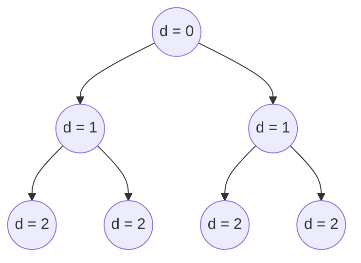

`b` = 2

`d` = 2 (0-indexed)

$N(b,d) = \frac{b}{b-1}b^d = O(b^d)$

### Breadth First Search

Expand fringe nodes that have smallest depth. Use a queue.

- Optimal? Yes
- Complete? Yes
- Time? $O(b^d)$
- Space? $O(b^d)$

### Depth First Search

Expand child nodes recursively, or using a stack.

- Optimal? No (tree could search deeper nodes when goal node is at a lower
  depth)
- Complete? No (tree could be infinite)
- Time? $O(b^m)$
- Space? $O(b\cdot m)$

### Check layer by layer?

- Time? $b^d (\frac{b}{b-1})^2 = O(b^d)$

# Lecture 4

## Heuristics

### Uniform-Cost Search (UCS)

Generalizes breadth-first search (allows arbitrary costs) for actions

- Always expand node on fringe that has least cost
- Suppose $\epsilon$: Smallest cost `y` of any action
- If the optimal solution has cost `C*` ithen we may have to go down to depth
  $\lceil C^\ast / \epsilon\rceil$

#### Evaluation of UCS

- Complete? **Yes**
- Optimal? **Yes**
- Time complexity? $b^{\lceil C^\ast / \epsilon\rceil}$
- Space complexity? $b^{\lceil C^\ast / \epsilon\rceil}$

### Greedy Search

Faster than UCS but not always optimal. Requires a heuristic.

#### Evaluation of Greedy

- Complete? **No**
- Optimal? **No**
- Time complexity? $O(b^{m})$ (must store heuristic function for nodes during
  traversal)
- Space complexity? $O(b^{m})$

#### Key Differences From UCS

- UCS evaluation function is $g(n)$, where $g(n)$ is the cost of the path from
  the initial node.
- Greedy evaluation function is $h(n)$ which is a heuristic that estimates the
  cost of the path from initial node to goal node.
- **Example**: If trying to find path between cities (using roads to in-between
  cities) greedy would choose city closest to goal city (heuristic) while UCS
  would choose city with least distance from initial node

### A* Search

Combination of the two previous searches, with evaluation function $f(n) =
g(n) + h(n)$

- $g(n)$ is cost so far
- $h(n)$ is estimated cost to goal from n
- $f(n)$ is estimated total cost of a path that goes through `h`

#### Heuristic is "admissible"

- $h(n) \le h^{\ast}(n)$ where $h^{\ast}(n)$ is least cost to go from `n` to
  goal
- $h(n) \ge 0$
- $h(0) = \emptyset$

**A\* with an admissible heuristic $h(n)$ is optimal and complete.**

_For multiple heuristics $h_1$ and $h_2$, if $h_2(n) \ge h_1(n)$ then $h_2$
dominates $h_1$. In other words, $h(n) = max(h_1(n), h_2(n))$_

Speed / efficiency of the algorithm depends on how smart the heuristic is.

# Lecture 5

## Constraint Satisfaction Problems (CSP)

- Standard formulation of CSP's as search
- Standard search strategy
- Improvements: six total

### Formulation

- Set of variables $x_1 \ldots x_{n}$ with values $D_1 \ldots D_{n}$
  - These variables are discrete
- Set of constraints
  - Notion of desirability or penalty of violation (hard constraints vs soft
    constraints)
  - Unary (1 variable), Binary (2 variables), or higher-order constraints
    - SAT problem needs higher-order constraints to be NP-complete

**Example:** Three-colorable problem with Australian provinces:

- $x_i : WA, NT, SA, Q, NSQ, V, T$
- $D_i : {Red, Blue, Green}$
- Constraints: $WA \neq NT, WA \neq SA, \ldots$

**Example:** Problem with 3 variables, 2 values

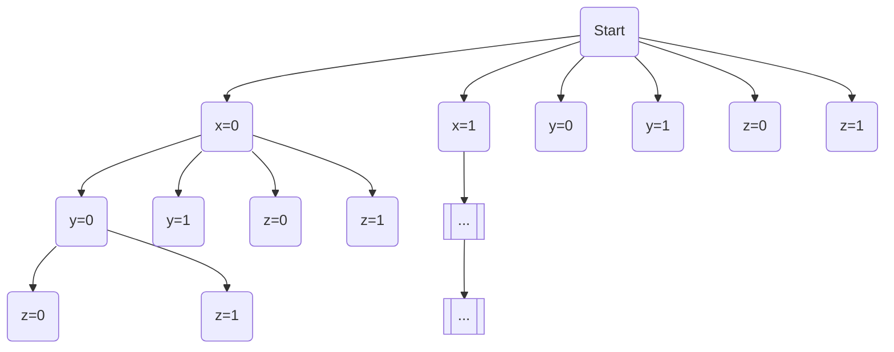

Number of possible states (with repetitions): $n \cdot d + (n-1) \cdot d +
\ldots + 1 \cdot d = n!\cdot d^n$

Max depth `n` (number of variables) and branching factor `d` (number of values)

### Observations

DFS is the best way to traverse such a problem.

**Reason:** There are many more ways such that you can say preemptively that
"this node is dead" and we don't have to traverse any of its children. There are
six methods in total:

1. No constraint is violated
2. two
3. three
4. Forward Checking
5. Arc Consistency
6. six

#### Forward Checking

- Maintain a set of values for each variable
- When you assign a value to a variable, update possible values for other
  variables
- Declare "bad state" if some variable loses all of its values

#### Arc Consistency

- 'Arc' is just an edge from one node to another
- An arc from `x` to `y` is consistent if, for every possible value of `x`,
  there is a compatible value for `y`
- This method finds some conditions that Forward Checking misses
- Checking a particular arc is $O(n^2 \cdot d^3)$

**Example:**

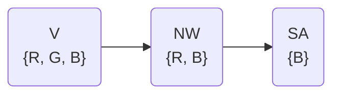

Arc V to NW is consistent, but arc NW to SA is not consistent because if NW is
`B`, SA loses all values.

# Lecture 6

## Variable & Value Ordering Heuristic

These heuristics are orthogonal: they serve different purposes and we should use
them both.

### Value Ordering

- Choose least constraining value
- Choose value that rules out the fewest values of remaining variables

### Variable Ordering

- Choose most constrained variable
- Choose variable with the fewest legal values

Bottom line: heuristics can benefit searches but they also have cost! We must
weigh the benefits versus the rewards.

## Two-player games

- The concept of a "Goal State" becomes replaced by a Terminal State
- We cannot control other player's actions! So our tree concept is not as
  useful... (no need to store path?)

### Minimax Algorithm

- Assume each state has some assigned "score" where the higher the score, the
  better it is for you as the player
- We assume the opponent is a perfect player who will always try to minimize
  your score
- With these assumptions, we use the minimax algorithm to pick branches of a
  decision tree that **maximizes** the **minimum** values (i.e., make it so the
  opponent's minimization of our score is always as high as possible)
- Scores are specific to a certain game and not arbitrary, but use assumptions
  - **Example:** For chess, assign a score or weight to ceratin pieces: pawns
    are worth less than rooks which are worth less than queens, etc.

### Alpha-Beta Pruning

- Check the book implementation
- Assume maximized nodes on depths / layers that are our turn, minimized nodes
  on levels that are our opponents turn
- Use this information to skip checking branches that we know will not fit our
  heuristic
- With depth `d` and branching factor `b` we have worse case $O(b^{d})$
  performance and best case $O(b^{\frac{d}{2}})$

# Lecture 7

## Knowledge Representation & Reasoning (Logic)

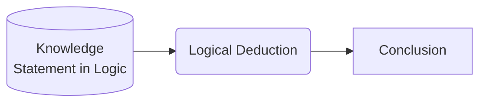

### Model

**(Old way: HIGH CORRECTNESS DESIRED but can be slow)**

- Symbolic: Logic
- Numeric: Probability

### Learn

**(Newer way: LOWER CORRECTNESS but viable because of abundance of data and
lower threshold of correctness required for many problems)**

- Data

"Neuro Symbolic Approach"

#### Example

You are an agent A. You can detect adjacent cells (not diagonals). **Pit** cells
have breezy cells adjacent to them and **Wumpus** cells have smelly cells
adjacent to them. We must avoid both.

We use reasoning to determine which cells are safe. Most animals are incapable
of this level of reasoning.

## First-Order Logic (Symbolic)

Uses symbols like $\exists, \forall,$ etc.

## Propositional Logic (Boolean)

- Syntax
  - Basic Syntax
    - Variables $x_1 \ldots x_{n}$
    - Logical Connectives (and ($\land$), or ($\lor$), not ($\lnot$), imply
      ($\implies$), equivalent ($\iff$))
    - Rules
      - A variable is a sentence
      - If S is a sentence, then not S is a sentence
      - If $S_1, S_2$ are sentences, then all of the following are sentences:
        - $S_1 \lor S_2$
        - $S_1 \land S_2$
        - $S_1 \implies S_2$
        - $S_1 \iff S_2$
  - Minimal Forms
- Semantic

### Normal Forms

- Conjunctive Normal Form (CNF):
  - Expressed as **conjunctions** of clauses
  - E.g. $(A \lor \lnot B) \land (B \lor \lnot C \lor \lnot D) \land \ldots$
- Disjunctive Normal Form (DNF):
  - Expressed as a **disjunction** of terms
    - A `term` is a conjunction of literals
  - E.g. $(A \land B \land \lnot C) \lor (X \land \lnot B \land Y) \lor \ldots$
- Negative Normal Form (NNF):
  - **Negation only appears near variables**
  - Literal is NNF
  - If $S_1, S_2$ are NNF's then:
    - $S_1 \land S_2$ is NNF
    - $S_1 \lor S_2$ is NNF
  - CNF and DNF are special cases of NNF

### Literal

- $X$ (Positive literal)
- $\lnot X$ (Negative literal)

### Horn Clause

Has at most one positive literal

- **Example**:
  - $A \lor B \lor \lnot C$? NO
  - $\lnot A \lor B \lor \lnot C$? YES
  - $\lnot A \lor \lnot B \lor \lnot C$? YES

### Clause

Connects literals with `or`

E.g. $A \lor \lnot B \lor C$

### Term

Connects literals with `and`

E.g. $A \land \lnot B \land C$

## Sentence Representations

**Example**

If there is a burglary or an earthquake, then my alarm will sound.

$B \lor E \implies A$

is equivalent to:

$\lnot A \implies \lnot B \land \lnot E$

| Worlds | Earthquake | Burglary | Alarm |
| ------ | ---------- | -------- | ----- |
| $W_1$  | T          | T        | T     |
| $W_2$  | T          | T        | F     |
| $W_3$  | T          | F        | T     |
| $W_4$  | T          | F        | F     |
| $W_5$  | F          | T        | T     |
| $W_6$  | F          | T        | F     |
| $W_7$  | F          | F        | T     |
| $W_8$  | F          | F        | F     |

All possible worlds based on this sentence number 8 in total. We can see which
worlds hold given the first sentence.

We check using the conversion $B \lor E \implies A \implies \lnot(B \lor E) \lor
A$

If this new sentence is `True` for a given world, then that world holds.

E.g. $W_1$ holds but $W_2$ does not.

## Meaning and Models

- $M(\alpha)$
  - Meaning of $\alpha$
  - Models of $\alpha$
    - Worlds that satisfy $\alpha$

### Properties

- $M(\alpha \lor \beta) = M(\alpha) \cup M(\beta)$
- $M(\alpha \land \beta) = M(\alpha) \cap M(\beta)$
- $M(\alpha) = M(\lnot \alpha)$

**Examples**

$\alpha$ is equivalent to $\beta$: $M(\alpha) = M(\beta)$

$\alpha$ is inconsistent: $M(\alpha) = \emptyset$

$\alpha$ is vacuous: $M(\alpha) = W$

# Lecture 8

### Semantics

- $M(\alpha) = \{w: w \vDash \alpha\}$
  - Meaning: $w$ satisfies/entails $\alpha$. In other words, $\alpha$ is true at
    world $w$.
- $\alpha \implies \beta$
  - $\lnot \alpha \lor \beta$
  - $\lnot (\alpha \land \lnot \beta)$
- $\alpha$ is **satisfiable** if $M(\alpha) \neq \emptyset$
- $P \implies Q$ is equivalent to $\lnot P \lor Q$

### Logic Definitions

- $\alpha$ and $\beta$ are equivalent:
  - $M(\alpha) = M(\beta)$
- $\alpha$ is inconsistent/unsatisfiable (always false):
  - $M(\alpha) = \emptyset$
- $\alpha$ is tautology/vacuous/valid (always true):
  - $M(\alpha) = \mathbb{W}$
- $\alpha, \beta$ are **mutually exclusive** (never true together):
  - $M(\alpha)\cap M(\beta) = \emptyset$
- $\alpha, \beta$ are **exhaustive**:
  - $M(\alpha) \cup M(\beta) = \mathbb{W}$
- $\beta$ follows from $\alpha$
  - $\alpha$ implies $\beta$
  - $\alpha$ entails $\beta$
  - $M(\alpha) \subseteq M(\beta)$

## Inference (Deduction)

Rules that permit you to add sets to your knowledge base given certain
conditions.

- **Example:** If $\alpha$ and $\alpha \implies \beta$, you may add $\beta$ to
  the knowledge base.
  - Expressed as $\frac{\alpha, \alpha \implies \beta}{\beta}$

**Or-Introduction:**

$$\frac{\alpha, \beta}{\alpha \lor \beta}$$

**And-Introduction:**

$$\frac{\alpha, \beta}{\alpha \land \beta}$$

**Modus Tollens:**

$$\frac{\alpha \implies \beta, \lnot \beta}{\lnot \alpha}$$

#### Semantics:

$\alpha$ can be derived from $\Delta$ using inference rules $R$: $\Delta
\vdash_R \alpha$

- Relation
  - $\Delta \vDash \alpha$
- Sentence
  - $\Delta \implies \alpha$

$\Delta \vDash \alpha$ **if** sentence $\Delta \implies \alpha$ is valid

### Given (knowledge base)

- $\alpha_1, \alpha_2, \ldots, \alpha_n$ (set)
- $\Delta = \alpha_1 \land \alpha_2 \land \ldots \land \alpha_n$ (single
  sentence)

### Question

Does sentence $\alpha$ from kb $\Delta$?

1. Truth table, model enumeration: $\Delta \vDash \alpha$, aka $M(\Delta)
   \subseteq M(\alpha)$
2. Inference rules
3. Reduction to SAT
4. Conversion to normal forms (knowledge compilation)

### Refutation Theorem

$$ \Delta \vDash \alpha \iff \nvDash \Delta, \lnot \alpha $$

Or

$$ \Delta \vDash \alpha \iff \Delta \land \lnot \alpha \text{ inconsistent} $$

The set of formulas $\Delta$ has a consequence $\alpha$ _if and only if_ the
system composed by $\Delta$ together with $\lnot \alpha$ is unsatisfiable.

### Inference Rules

#### Completeness

Inference rules $R$ are complete **if**: If $\Delta \vDash \alpha$, then $\Delta
\vdash_R \alpha$.

#### Soundness

Inference rules $R$ are sound **if**: $\Delta \vdash_R \alpha \subseteq \Delta
\vDash \alpha$

#### In Other Words

Soundness: inference rules are $\subseteq$ all truth

Completeness: inferences rules are $\supseteq$ all truth

**If $R$ is the whole truth and nothing but the truth:**

$R$ is sound and complete

#### Resolution

$$ \frac{\alpha \lor \beta, \lnot \beta \lor \gamma}{\alpha \lor \gamma} $$

(Uses $\frac{\alpha \implies \beta}{\lnot \alpha \lor \beta}$)

Resolution is "Refutation Complete" when applied to CNF (Conjunctive Normal
Form)

#### Examples

$$ \frac{A \lor B, \lnot B \lor C \lor D}{A \lor C \lor D} $$

$$ \frac{(A \lor \lnot B) \implies C, C \implies D \lor \lnot E, E \lor D}{A
\implies D} $$

### Solve with inference rules

#### Steps:

1. $\Delta \land \lnot \alpha$
2. Convert to CNF
3. Apply resolution
4. Test inconsistencies on $\lnot \alpha$
5. EITHER:
   1. Find inconsistency: $\Delta \vDash \alpha$
   2. Do **not** find inconsistency: $\Delta \nvDash \alpha$

In human terms: take all rules given, keep expanding them out to as many
different forms as possible, and if you do not find any contradictions (e.g. $A$
and $\lnot A$) then $\Delta \nvDash \alpha$

# Lecture 9

## Inference Methods

1. Truth tables
2. Inference rules: resolution (on CNF) $\Delta \vDash \alpha$
3. By conversion to SAT
4. By conversion to "hashable forms" (knowledge compilation)

### Converting Sentences Into CNF

1. Get rid of all connectives that are not $\lnot, \land, \lor$
   1. E.g. $\alpha \implies \beta$ $\longrightarrow$ $\lnot \alpha \lor \beta$
2. Use De Morgan's law to push negations inside:
   1. E.g. $\lnot (\alpha \land \beta) \longrightarrow \lnot \alpha \lor \lnot
      \beta$
3. Distribute $\lor$ and $\land$

### SAT

- $\Delta \vDash \alpha \iff \Delta \lor \lnot \alpha \text{ Unsat}$
- $\Delta$ is equivalent to $\alpha$:
  - $\Delta \vDash \alpha, \alpha \vDash \Delta$
- $\Delta$ is valid:
  - $\lnot \Delta \text{ Unsat}$

### Conversion to SAT

#### Backtracking (DFS) + Detecting Failures

Known as DPLL

- Uses var/value ordering
- Unit resolution
  - Fast
  - Removes redundant/unnecessary information
  - E.g. $\frac{\lnot A, B, A \lor \lnot B \lor C \lor \lnot D}{C \lor \lnot D}$
    - (We can remove variables that have conflicting parity)

##### Search Strategies

Complete? Systematic search

Incomplete? Local search

###### Local Search

Search worlds, trying to minimize violated clauses or maximize satisfied clauses
(depending)

**Side walk**: Structure where a neighboring solution differs from the current
solution in exactly one variable.

## NNF Circuit

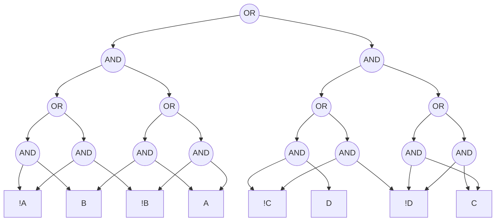

- Decomposable:
  - For every conjunction (and) $\alpha, \beta$: $vars(\alpha) \cap vars(\beta)
    = \emptyset$
- Deterministic:
  - For every disjunction (or) $\alpha, \beta$: $\alpha \land \beta \text{
    unsat}$
- Smooth:
  - For every disjunction (or) $\alpha, \beta$: $vars(\alpha) = vars(\beta)$

# Lecture 10

## First-Order Logic

FOL / Predicate Calculus (PC)

- Expressive
- Succinct

**Example:**

$\forall r: Pit(r) \Rightarrow [\forall s: Adjacent(r,s) \Rightarrow Breezy(s)]$

Explanation: For all squares that are pits, adjacent squares are breezy

### Worlds

- Objects:
  - People, houses, cells, wumpus, etc.
- Properties:
  - Smelly, large, red
- Relations:
  - inside, adjacent, large, sibling, etc.
- Functions:
  - Best friend of, etc.

**Examples:**

_One plus one equals two_

- Objects: one, two
- Relations: equals
- Functions: plus
- Properties: `None`

_Squares adjacent to the wumpus are smelly_

- Objects: wumpus, square
- Relations: adjacent
- Functions: `None`
- Properties: smelly

### Syntax

- Domain specific:
  - Constants:
    - 2, Jack, UCLA, etc.
  - Predicates:
    - adjacent, smelly, larger, etc.
  - Functions:
    - plus, left-of, etc.
- General:
  - Variables:
    - x, y, z, etc.
  - Connectives:
    - $\land, \lor, \lnot, \Rightarrow, \Leftrightarrow$
  - Equality:
    - $=$
  - Quantifiers:
    - $\forall, \exists$

### Atomic Sentence

- Predicate ($term_1, \ldots, term_m$)

### Term

- Constant
- Variable
- Function ($term_1, \ldots, term_m$)

### Universal Quantification

$\forall$ `<variable>` `<sentence>`

### Existential Quantification

$\exists$ `<variable>` `<sentence>`

### Properties of Quanitifiers

$\forall x \forall y$ `<sent>` same as $\forall y \forall x$ `<sent>`

$\exists x \exists y$ `<sent>` same as $\exists y \exists x$ `<sent>`

**DIFFERENT:**

$\forall x \exists y$ `<sent>` $\neq$ $\exists y \forall x$ `<sent>`

**Example:**

Predicate: $Loves(x,y) \longrightarrow \text{x loves y}$

- $\forall y \exists x : Loves(x,y)$
  - "Everyone is loved by someone"
- $\exists x \forall y : Loves(x,y)$
  - "There is someone who loves everyone"

**EQUIVALENT:**

- $\forall x : Likes(x, IceCream)$
- $\lnot \exists x : \lnot Likes(x, IceCream)$

Both mean everybody likes ice cream

**Example:**

Spot has two sisters

- Spot: Constant
- Sister: Predicate
- First-Order form
  - At least two sisters?
    - $\exists x,y : Sister(spot, x) \land Sister(spot, y) \land \lnot(x = y)$
  - Exactly two sisters?
    - _ABOVE CLAUSE, AND:_ $\lnot \exists z : Sister(spot, z) \land \lnot (x =
      a) \land \lnot (y = z)$
    - $\forall z : Sister(spot, z) \Rightarrow ((z = x) \lor (z = y))$

### Uniqueness Quantifier

$\exists! x : king(x)$

Equivalent statement:

$\exists x : king(x) \land \forall y : king(y) \Rightarrow (y = x)$

# Lecture 11

- Reducing FOL inference to propositional
- Single/Restricted Methods:
  - Forward chaining
  - Backward chaining
- Resolution:
  - FOL is semi-decidable
  - Refutation Complete: Guarantees to terminate (e.g. no longer applicable)

**Reminder:** Term = variable, constant, or func(term1, term2, ...)

**Ground Term:** Term that is _NOT_ a variable (and if it is a function it is a
function of ground terms)

Converting to propositional logic implies removing variables.

$\exists x : Crown(x) \land Onhead(x, John) \implies Crown(C_1) \land
Onhead(C_1, John)$

Where $C_1$ is a constant not mentioned anywhere in the knowledge base.

### Theorem (Herbrand, 1930)

If sentence $\alpha$ is _entailed_ by a FOL KB, then it is entailed by a finite
subset of the propositional KB.

### Forward and Backward Chaining

- Applied to restricted KB's
  - Definite clauses:
    - Exactly one positive literal
    - Distinct from Horn clauses, which are at most one positive literal
    - E.g.: $\lnot A \lor \lnot B \lor C \implies A \land B \Rightarrow C$
  - No function symbols

#### Forward Chaining

Start at given clauses, expand upwards until you can prove the desired
conclusion

#### Backward Chaining

Start at desired conclusion, expand downwards until you find all clauses listed
in the knowledge base

### Unification

**EXAMPLE:**

$\alpha = Knows(John, x), \beta = Knows(John, Jane)$

Substitution: $\theta = \{x / Jane\}$

$\alpha \theta = \beta \theta$

**EXAMPLE:**

$\alpha: Knows(John, x), \beta : Knows(y, OJ)$

$\theta = \{x / OJ, y / John\}$

$\alpha \theta = Knows(John, OJ) = \beta \theta$

# Lecture 12

Nothing noteworthy

# Lecture 13

## Probabilistic Logic

1. Probability as a basis of beliefs
2. Bayesian Networks
3. Inference
4. Learning

### Binary / Boolean Variable

- $x: \{t, f\}$
- $x, \lnot x \longrightarrow x=t, x=f \longrightarrow x, \overline{x}$

### Variable Independence

$\alpha, \beta$ are independent gives $\gamma$ if and only if $Pr(\alpha |
\beta, \gamma) = Pr(\alpha | \gamma)$

- Variable sets $X, Y, Z$
  - $X, Y$ are independent given $Z$
  - $Pr(x|y,z) = Pr(x|z)$ for all $x,y,z$
    - $X = {A, B}$
    - $X = {C}$
    - $Z = {D, E}$
    - Leads to $4 \cdot 2 \cdot 4$ possible combinations (each variable is
      either `true` or `false`, i.e. $A: a, \overline{a}$ and $B: b,
      \overline{b}$)

### Causal Graph

It is a DAG

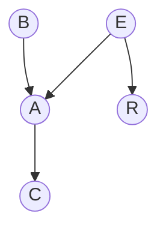

- Parents(v):
  - $A: E,B$
  - $R: E$
  - $C: A$
- Descendants(v):
  - $E: A,C,R$
  - $B: A,C$
  - $C: \emptyset$
- Non-Descendants(v):
  - $A:R$
  - $E:B$
  - $R:A,B,C$

I(v, Parents(v), Non-Descendents(v))

Meaning: v and Non-Descendents(v) are independent given Parents(v)

Example: $I(B, \emptyset, RE)$: $B$ and $RE$ are independent

What makes a Bayesian path blocked or closed?

# Lecture 14

## Inference

- Queries
- Algorithms
  - Core complexity result
  - Sketch state-of-the-art class of algorithms

## Modeling

---

1. Prior marginals
2. Posterior marginals
3. MPE: Most probable explanation
4. MAP: Maximimum a posterior hypothesis

- SDP: Some decision probability
- Causal queries:
  - Interventional queries
  - Counterfactual queries

### MPE

Out of a group of variables, choose the values for the variables in the group
with the highest probability (that probability is known as the MPE probability.
The group of variable values that gives this MPE is called the MPE
instantiation)

### MAP

More general than MPE. Given evidence, map variables for highest probability.
The variables are the Map instantiation, the probability that they coalesce into
is the MAP probability.

## Trees

Computing "node" marginals of a tree is $O(n\cdot d^{w})$ where $n$ is the
number of variables, $d$ is the (maximum) number of values, $w$ is the tree
width.

**NOTE:** Tree width is the maximum amount of parents per node.

1. Problem statement
2. Subjective benefit
3. Learning from data
   1. Variables
   2. Structure (edges)
   3. CPTs

### Bipartite Model

- Layer 1: Causes
- Edges: From layer 1 to layer 2
- Layer 2: Effects

### Naive Bayes Structure

Structure for classification tasks. Assumes presence of particular classes are
independent from other class features.

# Lecture 15

## Bayes' Rule

$$ Pr(A\mid B) = \frac{Pr(B\mid A)Pr(A)}{Pr(B)} $$

$$ Pr(A\mid B, C) = \frac{Pr(B\mid A)Pr(C\mid A)Pr(A)}{Pr(B, C)} $$

## D-Separation

D-separation guarantees independence, but **NO** d-separation doesn't guarantee
no independence.

_NOTE_: Python networks package has a good d-separation algorithm which maybe
should be studied. It cites a source for the algorithm as well.

## Learning

1. Parameters
   - Complete data
   - Incomplete data
2. Structure

### Parameters

Take an example network:

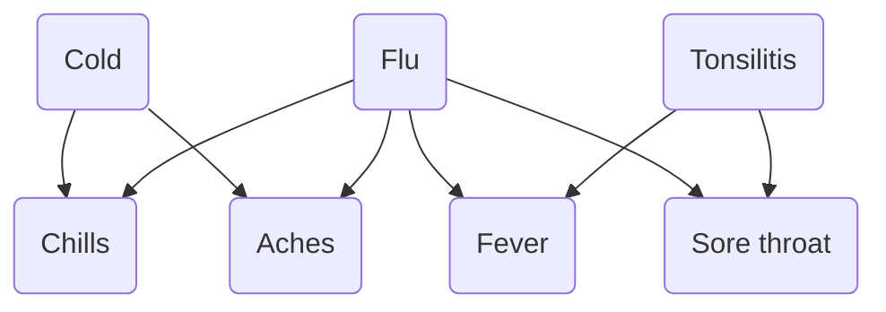

We have a complete data set if we have the value for every variable. If the data
set is complete, then the parameter values are unique.

Let's say that the illness variables are F and the effects of the sickness are
A.

| F | A |                                          |
| - | - | ---------------------------------------- |
| T | T | $\theta_{a\mid f}$                       |
| T | F | $\theta_{\overline{a}\mid f}$            |
| F | T | $\theta_{a\mid \overline{f}}$            |
| F | F | $\theta_{\overline{a}\mid \overline{f}}$ |

$a$ and $f$ are **parameters** of A and F.

Case example:

|          | Cold | Flu | Tonsilitis | Chills | Fever | Aches | Sore Throat |
| -------- | ---- | --- | ---------- | ------ | ----- | ----- | ----------- |
| $e_1$    | t    | ?   | f          | ?      | t     | f     | t           |
| $e_2$    |      |     |            |        |       |       |             |
| $\vdots$ |      |     |            |        |       |       |             |
| $e_n$    |      |     |            |        |       |       |             |

$e_1: Pr(C=t,T=f,F=t,A=f,S=t)$

The above is a complete data set, since all parameters are known.

**NOTE:** The _likelihood_ $L_1 = Pr_1(e_1)\cdot Pr_1(e_2)\cdot \ldots \cdot
Pr_1(e_n)$.

Similarly $L_2 = Pr_2(e_1)\cdot Pr_2(e_2)\cdot \ldots \cdot Pr_2(e_n)$.

**NOTE:** When _estimating_ a probability, use $\hat{\theta}_n$ rather than
$\theta_n$ (optional).

For solving probabilities for incomplete data sets, things are more difficult.

#### Expectation Maximization

Method to solve incomplete data sets. Involves calculating more and more
probabilities for hypothetical unknown values and multiplying them together. The
more you calculate and multiply the more accurate your estimate will be: given
enough, the values stop changing and the convergent value you have is the result
of the calculation.

# Lecture 16

## Learning

- Learn a model (generative learning, unsupervised)
- Learning a query (discriminative learning, supervised)
  - Examples: decision trees, random forest
  - Learn a "classifier"
- Learning parameters under complete data
- Learning parameters under incomplete data (EM algorithm)
- Learning structure

There is a distinction between labeled data and unlabeled data.

### Entropy of a Variable

Higher entropy means more uncertainty.

$$ENT(X) = -\sum_{\alpha} Pr(X) \log_{\theta} Pr(X)$$

### Conditional Entropy

$$ ENT(X\mid y) = -\sum_{x} Pr(x\mid y) \log_{\theta} Pr(x\mid y) $$

$$ENT(X\mid Y) = \sum_{y} Pr(y) \cdot ENT(x\mid y)$$

$$ENT(X\mid Y) \le ENT(X)$$

### Decision Trees

Example

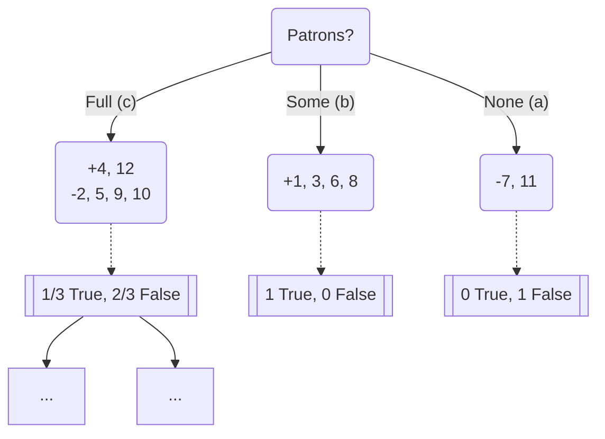

$$ENT(ww\mid Patrons) = (\frac{2}{12})a + (\frac{4}{12})b + (\frac{6}{12})c$$

# Lecture 17

## Machine Learning

- Neurons
- Neural Networks (syntax, semantics)
- Training NN

### Neurons

- Activations (input, output)
- Weights
- Bias
- Activation functions
  - Step
  - Sign
  - Sigmoid
  - Relu

#### Activation Functions

- Sigmoid: $g(x) = \frac{1}{1+e^{-x}}$
- Step: $g(x) = 1: x\ge t, g(x) = 0: x<t$ where $t$ is the **threshold**
- Sign: $g(x) = 1: x\ge 0, g(x) = 0: x<0$
- Relu: $g(x) = x: x\ge 0, g(x) = 0: x<0$

### Loss Function

Mean-square error

$$ MSE=\frac{1}{n} \sum_{i=1}^{n} (NN(I_i)-O_i)^{2} $$

$$ NN(I_i) = f_1(w_1, w_2,\ldots, w_k) $$

**<h1 style="text-align: center;">FINAL EXAM CHEATSHEET</h1>**

| Strategy            | Complete | Optimal | Time Complexity | Space Complexity |
| ------------------- | -------- | ------- | --------------- | ---------------- |
| Depth First         | No       | No      | $b^{m}$         | $b\cdot m$       |
| Breadth First       | Yes      | Yes     | $b^{d}$         | $b^{d}$          |
| Iterative Deepening | Yes      | Yes     | $b^{d}$         | $b\cdot d$       |
| Depth-Limited       | No       | No      | $b^{l}$         | $b\cdot l$       |

## Heuristics

- Admissibility
  - $0 \le h(n) \le h^{\ast}(n)$ where $h^{\ast}(n)$ is the true cost from node
    $n$ to the goal state
- Consistency
  - $h(n) \le c(n, a, n') + h(n')$ where $n'$ is a successor of $n$, $c(n, a,
    n')$ is the cost of the path from $n$ to $n'$ by choosing action $a$
  - $f(n)$ is _non-decreasing_ along any path

## NN Practice

We want to find $(A \lor \lnot B) \oplus (\lnot C \lor D)$ using the following
neural network:

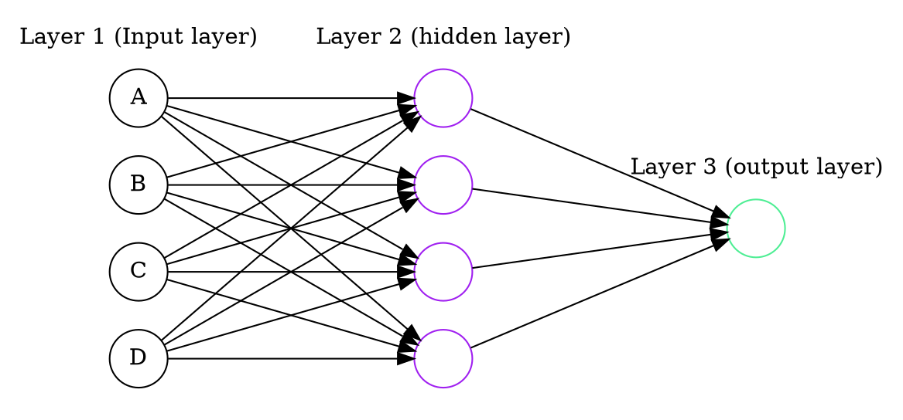

 

We will denote inputs as `true = 1` and `false = 0`.

First we will simplify the original equation using $x \oplus y = (\overline{x}
\land y) \lor (x \land \overline{y})$.

$$(A \lor \lnot B) \oplus (\lnot C \lor D)$$

$$= (\overline{(A \lor \lnot B)} \land (\lnot C \lor D)) \lor ((A \lor \lnot B)
\land \overline{(\lnot C \lor D)})$$

$$ = ((\lnot A \land B) \land (\lnot C \lor D)) \lor ((A \lor \lnot B) \land (C
\land \lnot D))$$

$$= (\lnot A \land B \land \lnot C) \lor (\lnot A \land B \land D) \lor (A \land
C \land \lnot D) \lor (\lnot B \land C \land \lnot D)$$

Now we can generate a neural network. We assign each hidden layer node to a term
where each input to the node is given a weight of 1 if the variable in that term
is positive, and a weight of -1 if the variable is negated. We will use blue to
denote a weight of 1 and red to denote a weight of -1.

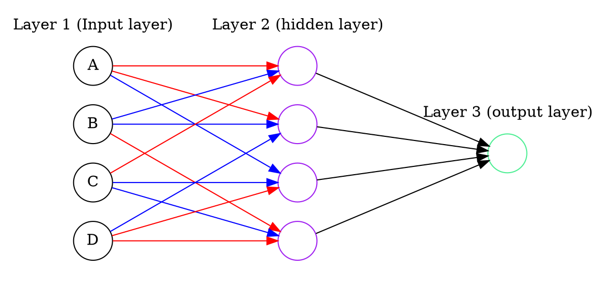

 

So this is our network so far. Since each term is a set of literals connected
with conjunctions (`AND`), we need each hidden layer node to output 1 only if
all given inputs are `true`. This happens if and only if the sum of the given
weights is equal to the amount of positive variable inputs. This is because the
hidden layer nodes use the step function, which is 1 when the sum of the inputs
are above or equal to the threshold, and 0 otherwise. The terms themselves are
positive (not negated) so we will just keep their output weights at 1 and the
output node threshold will be 1 since we only need 1 of the hidden layer nodes
to evaluate to `true` (the terms are connected with disjunctions (`OR`)). Our
finished network looks like this:

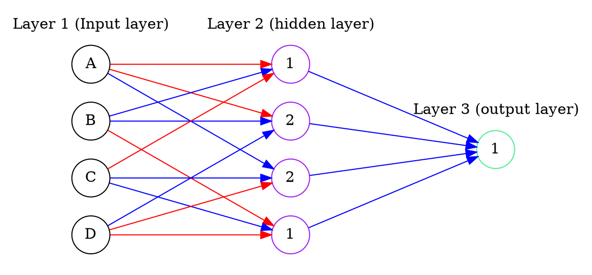

Bayes' theorem: $P(A\mid B) = \frac{P(B\mid A)\cdot P(A)}{P(B)}$
